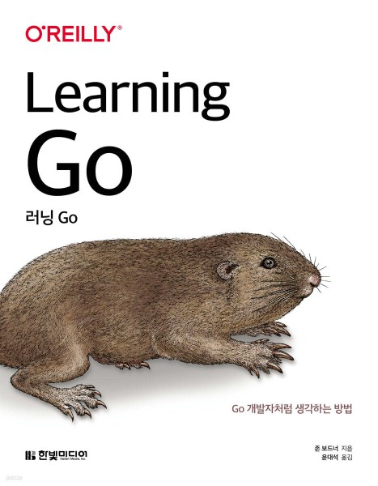

# 러닝 Go

1. Go 개발 환경 설정
2. [기본 데이터 타입과 선언](chapter02/README.md)
3. [복합 타입](chapter03/README.md)
4. [블록, 섀도, 제어 구조](chapter04/README.md)
5. [함수](chapter05/README.md)
6. [포인터](chapter06/README.md)
7. [타입, 메서드, 인터페이스](chapter07/README.md)
8. [오류](chapter08/README.md)
9. [모듈, 패키지 그리고 임포트](chapter09/README.md)
10. [Go 의 동시성](chapter10/README.md)

---

> [!QUOTE] 참고 자료
>
> **go.dev**
> 
> - [Go Documentation](https://go.dev/doc/)
> - [How to Write Go Code](https://go.dev/doc/code)
> - [Language Specification](https://go.dev/ref/spec)
