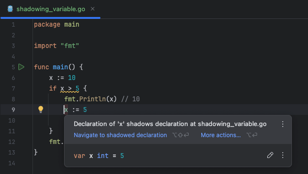

### 4.1.0 블록

> Q. golang 의 블록이 뭐야?
> 
> A. Go에서 “블록(block)“은 여러 개의 명령문(statements)을 하나의 그룹으로 묶는 코드의 영역을 의미합니다. 블록은 중괄호 {}로 감싸서 작성되며, 변수 선언, 조건문, 반복문, 함수 등의 범위를 제한하는 데 사용됩니다. Go에서 블록의 일반적인 용도는 다음과 같습니다.

1. 함수 블록: 함수의 본문을 나타내는 블록입니다.

```go
func sayHello() {
fmt.Println("Hello, Go!")
}
```

2. 조건문 블록: if, else if, else 조건문에서 사용되는 블록입니다.

```go
if condition {
    fmt.Println("Condition is true")
} else {
    fmt.Println("Condition is false")
}
```

3. 반복문 블록: for 루프에서 사용됩니다.
```go
for i := 0; i < 5; i++ {
    fmt.Println(i)
}
```

4. 스코프(scope) 블록: 중괄호를 사용하여 임시로 변수를 선언하거나 특정 코드의 범위를 제한할 수 있습니다.
```go
{
    x := 10
    fmt.Println(x)  // x는 이 블록 안에서만 유효
}
// 이 블록을 벗어나면 x는 유효하지 않음
```

### 4.1.1 섀도잉 변수

```go
func main() {
	x := 10
	if x > 5 {
		fmt.Println(x) // 10
		
		// 여기서 새로운 x가 선언되었습니다. 이 x는 외부 블록의 x와는 다른 변수입니다. 
		// 외부 블록의 x를 가리고 (shadowing), 이 x는 if 블록 내부에서만 유효합니다.
		x := 5 
		fmt.Println(x) // 5
	}
	fmt.Println(x) // 10
}
```

**섀도잉 변수**는 포함된 블록 내에 이름이 같은 변수가 있는 것을 의미한다.



### 4.1.2 섀도잉 변수 검출

- SKIP