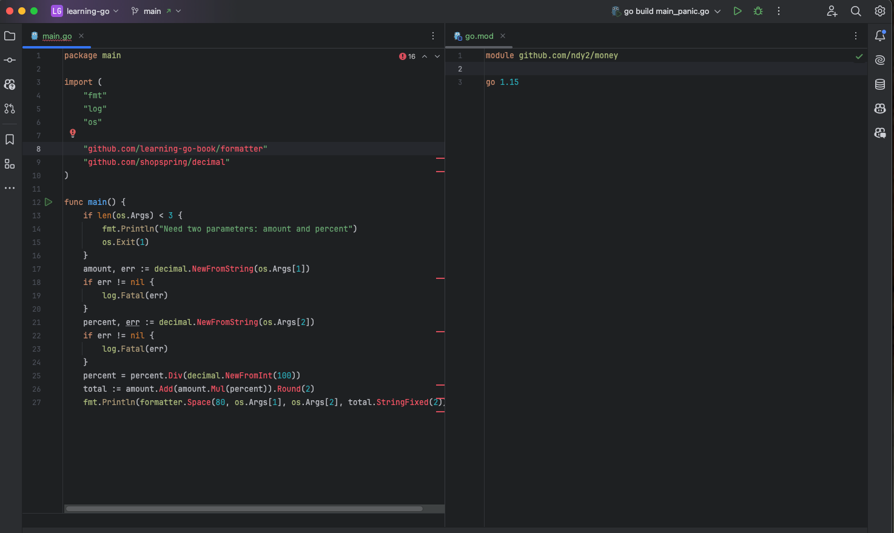
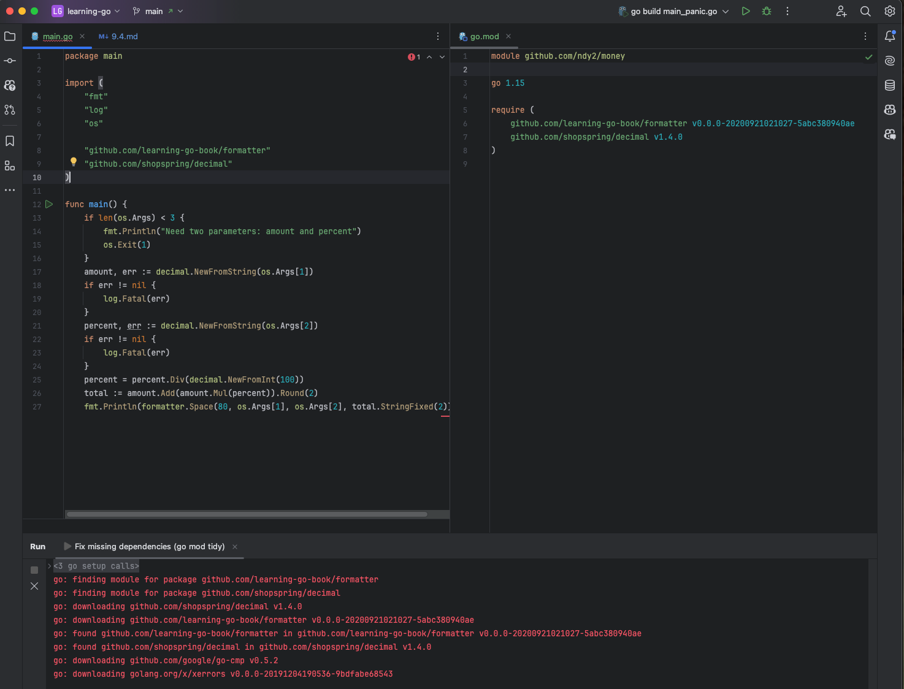
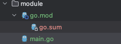

Go 는 서드-파티 패키지를 가져오기 위해서도 표준 라이브러리에서 패키지를 가져올 때와 같은 임포트 <sup>import</sup> 구문을 사용한다.

#### 예시: 패키지 등록 전



```
╭─deukyun@namdeug-yun-ui-Macmini ~/github/learning-go/codes/chapter09/module ‹main●› 
╰─$ go build
main.go:8:2: no required module provides package github.com/learning-go-book/formatter; to add it:
        go get github.com/learning-go-book/formatter
main.go:9:2: no required module provides package github.com/shopspring/decimal; to add it:
        go get github.com/shopspring/decimal
```

#### 예시: 패키지 다운로드 후

```
╭─deukyun@namdeug-yun-ui-Macmini ~/github/learning-go/codes/chapter09/module ‹main●› 
╰─$ go build
main.go:8:2: no required module provides package github.com/learning-go-book/formatter; to add it:
        go get github.com/learning-go-book/formatter
main.go:9:2: no required module provides package github.com/shopspring/decimal; to add it:
        go get github.com/shopspring/decimal


╭─deukyun@namdeug-yun-ui-Macmini ~/github/learning-go/codes/chapter09/module ‹main●› 
╰─$  go get github.com/learning-go-book/formatter                                                                                                                                                                                                                                                                                                                                                                          130 ↵

go: added github.com/learning-go-book/formatter v0.0.0-20200921021027-5abc380940ae
╭─deukyun@namdeug-yun-ui-Macmini ~/github/learning-go/codes/chapter09/module ‹main●› 
╰─$  go get github.com/shopspring/decimal

go: added github.com/shopspring/decimal v1.4.0
```

혹은 GoLand `option + enter`



#### 이후: go.sum 파일이 생성된다.

```
╭─deukyun@namdeug-yun-ui-Macmini ~/github/learning-go/codes/chapter09/module ‹main●› 
╰─$ ls
 go.mod   go.sum   main.go
```



```go.sum
github.com/google/go-cmp v0.5.2 h1:X2ev0eStA3AbceY54o37/0PQ/UWqKEiiO2dKL5OPaFM=
github.com/google/go-cmp v0.5.2/go.mod h1:v8dTdLbMG2kIc/vJvl+f65V22dbkXbowE6jgT/gNBxE=
github.com/learning-go-book/formatter v0.0.0-20200921021027-5abc380940ae h1:TRWDqrPLdqr3L6T0reL3A7/ArQ194nVFY7frsixLYdQ=
github.com/learning-go-book/formatter v0.0.0-20200921021027-5abc380940ae/go.mod h1:YSLNw1QDbIcM0EvYO9bUmuMrIPv1NNCn8KxYKBj5ZE8=
github.com/shopspring/decimal v1.4.0 h1:bxl37RwXBklmTi0C79JfXCEBD1cqqHt0bbgBAGFp81k=
github.com/shopspring/decimal v1.4.0/go.mod h1:gawqmDU56v4yIKSwfBSFip1HdCCXN8/+DMd9qYNcwME=
golang.org/x/xerrors v0.0.0-20191204190536-9bdfabe68543 h1:E7g+9GITq07hpfrRu66IVDexMakfv52eLZ2CXBWiKr4=
golang.org/x/xerrors v0.0.0-20191204190536-9bdfabe68543/go.mod h1:I/5z698sn9Ka8TeJc9MKroUUfqBBauWjQqLJ2OPfmY0=
```

#### 더 이후: go build

```
╭─deukyun@namdeug-yun-ui-Macmini ~/github/learning-go/codes/chapter09/module ‹main●› 
╰─$ go build
╭─deukyun@namdeug-yun-ui-Macmini ~/github/learning-go/codes/chapter09/module ‹main●› 
╰─$ ls
 go.mod   go.sum   main.go   money
```

#### go.sum 파일이란?

- go.sum 파일은 module 의 content 에 대한 hash 값을 저장하여 module 의 안정성 보장
